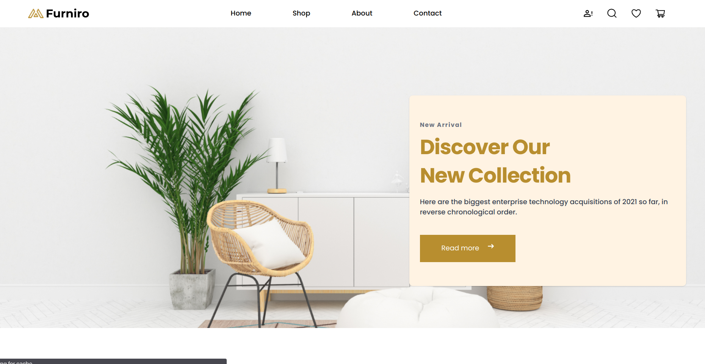

# 🛋️ Furniro — Modern Furniture E-Commerce Website

<p align="center">



</p>

<p align="center">


</p>

---

# 📖 Overview

Furniro is a fully responsive furniture e-commerce website built using **HTML5**, **Tailwind CSS**, and **Vanilla JavaScript**.

The project focuses on building a scalable front-end architecture by applying reusable components, modular JavaScript, clean folder organization, and efficient state management techniques.

Rather than relying on frameworks, the project demonstrates how a production-ready application can be developed using modern browser APIs and ES6 modules.

---

# ✨ Key Features

- Fully Responsive Design
- Modern UI/UX
- Dynamic Product Rendering
- Product Details Page
- Shopping Cart
- Wishlist
- Product Comparison
- Quantity Management
- Local Storage Persistence
- Modular JavaScript Architecture
- Reusable Components
- Clean Folder Structure
- Scalable Project Organization
- Interactive User Experience

---

# 🛠 Tech Stack

| Technology | Usage |
|------------|-------|
| HTML5 | Semantic Structure |
| Tailwind CSS | Styling |
| JavaScript (ES6+) | Application Logic |
| LocalStorage | Persistent Data |
| Git | Version Control |
| GitHub | Repository Hosting |

---

# 🏗 Project Architecture

The project follows a modular architecture where every feature is isolated into independent modules.

```
Pages
│
├── Home
├── Shop
├── Product Details
├── Cart
├── Checkout
└── Comparison

Components
│
├── Navbar
├── Footer
├── Product Card
├── Product Grid
├── Billing Section
└── Gallery

State
│
├── Cart State
├── Wishlist State
└── Compare State

Utilities
│
├── Price Formatter
├── Storage Helpers
└── Validation Helpers
```

This architecture improves:

- Maintainability
- Scalability
- Reusability
- Readability

---

# 📂 Project Structure

```
Furniro
│
├── assets
│
├── components
│
├── pages
│
│   ├── home
│   ├── shop
│   ├── cart
│   ├── checkout
│   ├── comparison
│   └── product
│
├── state
│
├── utils
│
├── styles
│
├── images
│
├── index.html
│
└── README.md


# 🚀 Getting Started

Clone the repository

```bash
git clone https://github.com/your-username/Furniro.git
```

Go to the project

```bash
cd Furniro
```

Open

```
index.html
```

or run using Live Server.

---

# 🎯 Learning Objectives

This project was built to strengthen practical front-end development skills including:

- Modular JavaScript
- Component-Based Development
- State Management
- Responsive Design
- DOM Manipulation
- Local Storage
- Scalable Project Structure
- Clean Code Principles

---

# 📈 Performance Highlights

✔ Lightweight Project

✔ Optimized Folder Structure

✔ Reusable UI Components

✔ ES6 Modules

✔ Minimal Dependencies

✔ Fast Rendering

✔ Responsive Layout

---

# 🚧 Future Improvements

- Backend Integration
- Authentication
- Payment Gateway
- Product Search API
- Filtering & Sorting API
- Dark Mode
- User Dashboard
- Order Tracking
- Admin Panel
- React Version
- TypeScript Migration

---

# 💡 What I Learned

Throughout this project I gained hands-on experience in building scalable front-end applications without using frameworks.

The project helped me improve:

- Project Architecture
- Code Organization
- Component Design
- State Management
- JavaScript Modules
- Debugging
- Responsive Layout Techniques
- Clean Code Practices

---

# 🤝 Contributing

Contributions, issues, and feature requests are welcome.

Feel free to fork the repository and submit a pull request.

---

# 📄 License

This project is licensed under the MIT License.

---

# 👨‍💻 Author

**Marwan Mostafa**

Mechanical Engineering Student

Aspiring Software Engineer

Frontend Developer

---

⭐ If you found this project helpful, consider giving it a **Star** on GitHub.
